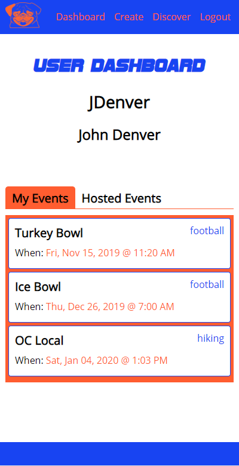

# PickUp Game
Otherwise known as PUG Sports, provides you the ability to find and participate in local pickup games from a variety of different sports.
[Live version](https://pickup-game.now.sh/)

## Description
PickUp Game "PUG Sports" is an app that provides users the ability to find local pickup games to participate in.

### Dashboard
The user dashboard shows the username and the user's first and last name.
There is then a 'My Events' tab that'll show all the events that you've signed up to play in.
There is also a 'Hosted Events' tab that shows the Events that you created and are hosting.

### Create
The create form is how you create and host a new event.

### Discover
The discover page contains a list of all the available events.

## Dependencies
### react-tabs
Used in the dashboard to toggle between My Events and Hosted Events. Here is the [link](https://www.npmjs.com/package/react-tabs) for the documentation of this dependency.

### react-datetime-picker
Used in the create event page to create a component that selects both a date and time for the created event. Here is the [link](https://www.npmjs.com/package/react-datetime-picker) for the documentation of this dependency.

## Roadmap
<ul>
    <li>Filter functionality on the discover page.</li>
    <li>Location enabled.</li>
    <li>Enabling previewing other user profiles.</li>
</ul>

## Technologies Used
*   React
